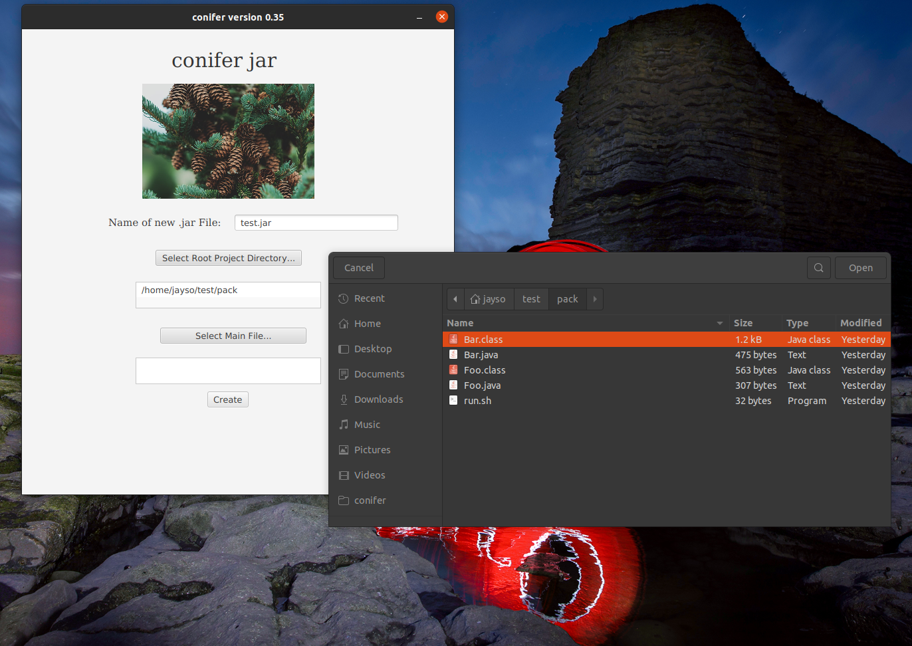

# conifer jar version 0.36 (in development)

## about

conifer is a basic app that creates an executable jar file from a file with a .java extension.
### images

## usage

## author 

Jayson C. Garrison @ The University of Tulsa. Efforts in AI/ML, affiliated with TU MASTERS and their research efforts, and pursuing two B.S. degrees in Mathematics and Computer Science.

## etc

### what I have learned

I decided that it was time to start developing basic apps and side projects. I needed to make a .jar file and decided that I could write a process to do this instead of manually running commands each time. IDEs like Eclipse and Intellij already have this built in feature but others do not. I prefer to do these processes manually as there is always something to learn when one does it this way.

Regarding what I have learned: I originally wanted ot develop a GUI in java swing but it was so antiquated and monotonous that I decided to learn JavaFX instead. There was a hurdle in making it applicable with VSCode as there is not native support for it as of now, but after I got it working it was much simpler and elegant (which is why developers don't even use swing anymore).
